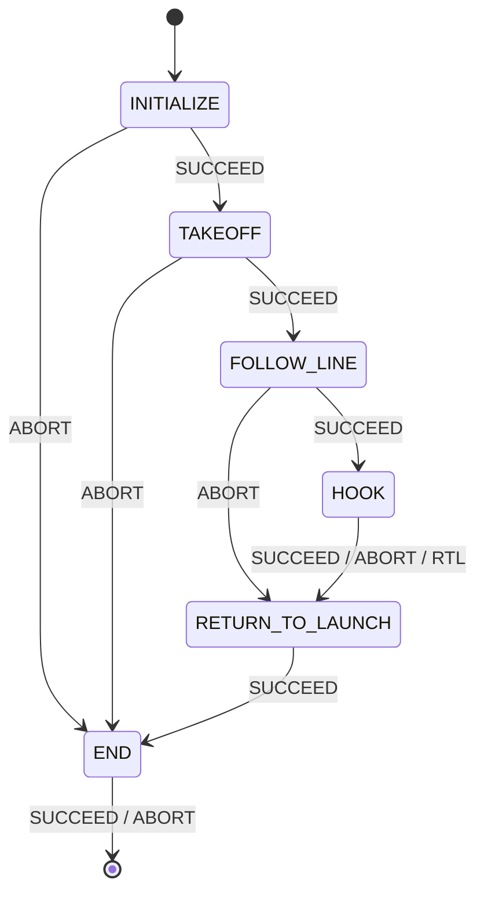
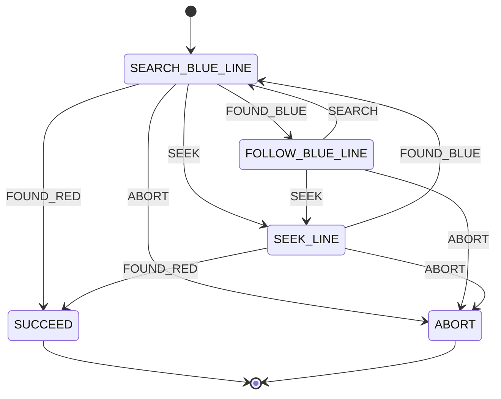
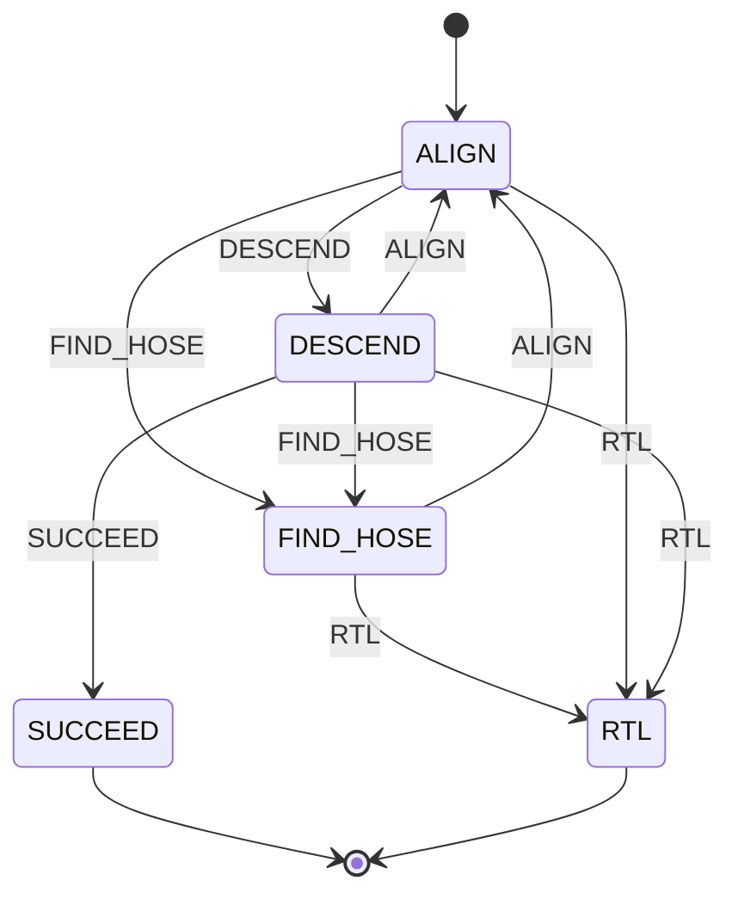

# Hang The Hook

**Autonomous line-following and hose-hooking mission for a MAVLink-controlled drone, orchestrated as a hierarchical finite-state machine on ROS 2.**

## Overview

`hang_the_hook` flies a drone autonomously through a full "find and hook" sequence:

1. **Take off** to a configured altitude.
2. **Follow a blue line** on the ground using a downward-facing camera and PID-based visual servoing, with automatic recovery if the line is lost.
3. **Locate a red hose** at the end of the line, **align** above it, and **descend** in a controlled manner.
4. **Hang the hook** by actuating a servo once the drone is close enough to the hose.
5. **Return to launch** and land.

The mission is built with [YASMIN](https://github.com/uleroboticsgroup/yasmin) (Yet Another State MachINe), a hierarchical finite-state-machine library for ROS 2, and can target either real hardware (MAVLink over serial) or a Gazebo SITL simulation, toggled by a single `SIM_MODE` flag in `core/constants.py`.

The mission entry point is the `mangalarga()` function in `mangalarga.py`, which builds the top-level state machine (`HangTheHookSM`) and publishes it to the [YASMIN Viewer](#visualizing-the-state-machine) for live inspection.

## Architecture

The mission is a state machine of state machines: one top-level FSM coordinates two nested sub-FSMs — one for line-following, one for the hook-and-descend sequence. Every state and sub-machine shares data through a single YASMIN `Blackboard` instance.

### Top-level mission — `HangTheHookSM`



`FOLLOW_LINE` and `HOOK` are themselves nested state machines (`FollowLineSM` and `hookSM`).

### Follow-line sub-machine — `FollowLineSM`



Spotting the red hose (`FOUND_RED`) at any point exits the sub-machine with `SUCCEED`, handing control back to the top-level FSM.

### Hook sub-machine — `hookSM`



This sub-machine starts on `ALIGN`, not `FIND_HOSE` — the hose is assumed to already be roughly in view once `FollowLineSM` hands off control.

### Recovery behavior

Each layer of the mission has its own local fallback before escalating:

- **Losing the blue line** while following it (`FollowBlueLine`) triggers a growing square search (`SeekLine`) before giving up.
- **Losing the hose** while aligning or descending (`Align`, `Descend`) triggers a local cross-pattern search (`FindHose`) before giving up.
- Exhausting a recovery attempt escalates to the sub-machine's own give-up outcome — `ABORT` for the follow-line sub-machine, `RTL` for the hook sub-machine — and the top-level FSM always routes any `HOOK` or `FOLLOW_LINE` failure through `RETURN_TO_LAUNCH` before `END`.

## Project structure

Inferred from the module imports across the provided files:

```
hang_the_hook/
├── core/
│   ├── states.py         # Initialize, Takeoff, ReturnToLaunch, End
│   └── constants.py      # SIM_MODE, image/camera size, PID and altitude constants
├── followlineSM/
│   ├── followlineSM.py   # FollowLineSM state machine
│   ├── states.py         # SearchBlueLine, FollowBlueLine, SeekLine
│   └── constants.py      # PID gains, detection thresholds, seek-pattern constants
├── hookSM/
│   ├── hookSM.py          # hookSM state machine
│   ├── states.py          # FindHose, Align, Descend
│   └── constants.py       # PID gains, alignment/descent thresholds, servo config
├── utils/
│   ├── blackboard_utils.py  # blackboard_check() helper
│   └── errors/               # error_log.csv, (re)written at runtime
├── images/                   # debug snapshots saved at runtime
└── mangalarga.py              # entry point — builds and runs HangTheHookSM
```

## State reference

### Core mission states — `core/states.py`

| State | Outcomes | Purpose |
|---|---|---|
| `Initialize` | `SUCCEED`, `ABORT` | Connects to the drone (MAVLink, or SITL/Gazebo when `SIM_MODE` is on), opens the camera, builds the blue-line and red-hose `LineDetector`s, builds the three `PIDController`s, waits for a valid altitude reference (up to `MAX_ALTITUDE_REFERENCE_LOSS` retries), and resets the CSV error log. Populates the blackboard with `drone`, `camera`, `line_detect`, `hose_detect`, `pid_cx`, `pid_cy`, `pid_angle`. |
| `Takeoff` | `SUCCEED`, `ABORT` | Takes off to `TAKEOFF_HEIGHT` (up to 5 retries). |
| `ReturnToLaunch` | `SUCCEED`, `ABORT` | Commands an RTL to `RTL_ALTITUDE` without landing (`land=False`), then a short delay. |
| `End` | `SUCCEED`, `ABORT` | Lands the drone. Closes the camera in a `finally` block, so cleanup runs even after an exception. |

### Follow-line sub-machine states — `followlineSM/states.py`

| State | Outcomes | Purpose |
|---|---|---|
| `SearchBlueLine` | `FOUND_BLUE`, `FOUND_RED`, `SEEK`, `ABORT` | Hovers while scanning for both the blue line and the red hose, requiring `MIN_BLUE_FRAMES` / `MIN_RED_FRAMES` consecutive stable detections (within `CENTER_VARIATION` px of each other) to confirm either one. Falls back to `SEEK` if nothing is detected for `SEARCH_TIMEOUT` seconds. |
| `FollowBlueLine` | `SEARCH`, `SEEK`, `ABORT` | Visually servos along the blue line with PID control on its horizontal offset and angle, driving lateral and yaw velocity while moving forward at a constant `FOWARD_SPEED_BLUE_LINE`. Returns to `SEARCH` once the correction converges on a frame where the line was actually seen; goes to `SEEK` after `MAX_LOST_FRAMES` consecutive missed frames. Best-effort logs `cx_error` / `angle_error` to a CSV file on every detected frame — a logging failure never aborts the mission. |
| `SeekLine` | `FOUND_BLUE`, `FOUND_RED`, `ABORT` | Recovery state: flies an outward-growing square search pattern (side grows by `SEEK_SQUARE_GROWTH` on each of up to `SEEK_MAX_SQUARES` attempts), scanning for either line on every leg. `ABORT`s once all squares are exhausted with nothing found. |

### Hook sub-machine states — `hookSM/states.py`

| State | Outcomes | Purpose |
|---|---|---|
| `FindHose` | `ALIGN`, `RTL` | Used when the hose is out of frame. Steps through an ascend-then-sweep search pattern (ascend if under `MAX_ALT`, then a sequence of moves along the axes from the starting point) until the hose is detected; gives up to `RTL` once the sequence is exhausted. |
| `Align` | `DESCEND`, `FIND_HOSE`, `RTL` | Centers the drone above the hose with PID control on the camera-frame X/Y offset and hose angle, converted into roll (`vy`), pitch (`vx`), and yaw (`vyaw`) velocity commands, targeting the camera center offset by `SHIFT`. Confirms alignment after `ALIGNMENT_MIN_FRAMES` consecutive in-tolerance frames; pauses and resets the PIDs after `ALIGNMENT_MAX_LOSS` lost-alignment events; gives up to `RTL` after `ALIGNMENT_MAX_RETRIES` retries, or drops to `FIND_HOSE` after `ALIGNMENT_MAX_NONE_LINE_DETECTION` consecutive missed detections. |
| `Descend` | `SUCCEED`, `ALIGN`, `FIND_HOSE`, `RTL` | Descends in `DESCEND_STEP` increments while continuously re-checking hose alignment; drops back to `ALIGN` if the hose drifts outside `CENTER_TOLERANCE` / `ANGULAR_TOLERANCE`, or to `FIND_HOSE` after `DESCEND_MAX_NONE_LINE_DETECTION` missed detections. At `DROP_DIST` altitude, actuates the hook servo (`do_servo`, channel `AUX_OUT`, `PWM_VALUE`) and returns `SUCCEED`. |

## Shared blackboard keys

| Key | Set by | Read by |
|---|---|---|
| `drone` | `Initialize` | every state that moves the drone |
| `camera` | `Initialize` | every vision-dependent state |
| `line_detect` | `Initialize` | `SearchBlueLine`, `SeekLine`, `FollowBlueLine` |
| `hose_detect` | `Initialize` | `SearchBlueLine`, `SeekLine`, `FindHose`, `Align`, `Descend` |
| `pid_cx`, `pid_cy`, `pid_angle` | `Initialize` | `FollowBlueLine` (`pid_cy`, `pid_angle`), `Align` (all three) |
| `angle_blue`, `center_x_blue` | `SearchBlueLine`, `SeekLine` | `FollowBlueLine` |

## Requirements

- **ROS 2** (`rclpy`)
- **[YASMIN](https://github.com/uleroboticsgroup/yasmin)**, `yasmin_ros`, and `yasmin_viewer` — the hierarchical state-machine framework and its web-based viewer
- **`nectar`** — this project's own drone-control (`nectar.control`) and vision (`nectar.vision`) abstraction layer: `DroneFactory` / `MavrosDrone` / `MavlinkDrone`, `PIDController`, movement and RTL helpers, plus `ImageHandler` / `LineDetector` and camera configs for both a real camera (OpenCV) and a simulated one (ROS topic). This is a project-specific dependency, not the unrelated `nectar` packages on PyPI — install it from wherever your team distributes it.
- **OpenCV** (`cv2`) — used for saving debug snapshots
- A MAVLink-speaking flight controller reachable over serial (real hardware), or a Gazebo SITL setup for `SIM_MODE = True`

## Configuration

Behavior is tuned entirely through three `constants.py` files rather than hard-coded in the states:

- `core/constants.py` — `SIM_MODE`, image/camera size, takeoff/RTL altitude, PID gains used during initialization, altitude-reference retry limit
- `followlineSM/constants.py` — PID gains for lateral/angle correction, detection-stability thresholds, forward speed, seek-pattern geometry, timeouts
- `hookSM/constants.py` — PID gains for alignment, altitude limits, search-step distance, center/angle tolerances, retry/loss limits, descent step size, drop altitude, and the hook servo channel/PWM value

## Running the mission

`mangalarga.py` is guarded by `if __name__ == "__main__":`, so at minimum it can be run directly:

```bash
ros2 run hang_the_hook mangalarga
```

If `hang_the_hook` is set up as an installed ROS 2 / colcon package, it would typically also be runnable via `ros2 run hang_the_hook mangalarga` or an installed console-script entry point — check your `setup.py` / `package.xml` for the exact name, since that isn't visible from the states/mission files alone.

Regardless of where the mission fails, it always attempts to land: `Initialize` and `Takeoff` failures route straight to `END`, and every other failure routes through `RETURN_TO_LAUNCH` first.

### Visualizing the state machine

The mission publishes itself to a YASMIN Viewer instance while running, via `YasminViewerPub(mangalarga_sm, 'MANGALARGA_FSM')`.

```bash
# Install (Ubuntu/Debian)
sudo apt install ros-$ROS_DISTRO-yasmin ros-$ROS_DISTRO-yasmin-ros ros-$ROS_DISTRO-yasmin-viewer

# Run the viewer node
ros2 run yasmin_viewer yasmin_viewer_node

# Open the web UI
http://localhost:5000/
```

To run the viewer on a different host/port:

```bash
ros2 run yasmin_viewer yasmin_viewer_node --ros-args -p host:=127.0.0.1 -p port:=5032
```

## Runtime artifacts

- `utils/errors/error_log.csv` — reset at the start of every run by `Initialize`; `FollowBlueLine` appends `cx_error, angle_error, timestamp` on every frame where the blue line is detected.
- `images/` — timestamped debug snapshots (`YYYYMMDD_HHMMSS.png`) saved whenever `SearchBlueLine` confirms a detection.
