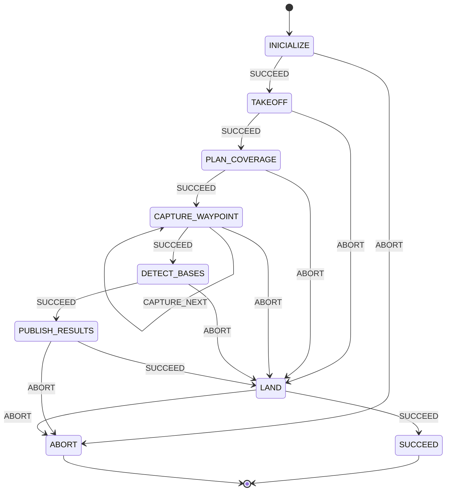

# Mapping Mission

**Autonomous coverage-flight, base-detection and geolocation mission for a drone (MAVROS or MAVLink), orchestrated as a hierarchical finite-state machine on ROS 2.**

## Overview

The `mapping` mission flies a drone autonomously through a full "survey and report" sequence:

1. **Initialize** the drone connection (MAVROS or MAVLink) and open/test the down-facing camera.
2. **Take off** to the configured altitude and settle into position.
3. **Plan a coverage grid** of waypoints that guarantees 100% camera coverage of the arena, from the camera FOV/resolution and arena size in `config.yml`.
4. **Fly to every waypoint**, capturing the sharpest of N photos at each one (self-looping until the grid is exhausted).
5. **Detect bases** in every captured photo (color/shape square markers) via an OpenCV threshold+contour pipeline or a YOLO model, deduplicating detections of the same physical base seen from multiple waypoints — including retry and edge-recovery passes for bases missed or cut off on the first pass.
6. **Publish the results**: convert each detected base's local coordinates to GPS, publish one message per base on a ROS topic, and save proof photos plus a JSON report to disk.
7. **Land**, via RTL or a direct LAND command depending on configuration.

The mission is built with [YASMIN](https://github.com/uleroboticsgroup/yasmin) (Yet Another State MachINe), a hierarchical finite-state-machine library for ROS 2. It targets a MAVROS-connected drone (real hardware or SITL) or a MAVLink-connected one, and either a simulated (ROS topic) or a real (OpenCV/USB) down-facing camera, toggled by `config.sim_mode`.

The mission is wired up by `MappingSM`, which builds the state machine described below from a loaded `Config` and starts it at `INICIALIZE`.

## Architecture

A single flat FSM (`MappingSM`) coordinates the whole mission; every state shares data through one YASMIN `Blackboard` instance, and `LAND` is the common path any failure is routed through before the mission ends.



`CAPTURE_WAYPOINT` is the only self-looping state: it stays in `CAPTURE_WAYPOINT` (outcome `CAPTURE_NEXT`) until every planned waypoint has been visited, then moves on with `SUCCEED`.

### Recovery behavior

Every state after `TAKEOFF` routes its own `ABORT` straight to `LAND` rather than skipping it, so the drone always attempts to land safely once it's airborne — only `INICIALIZE`'s own failure (drone/camera never came up) and `PUBLISH_RESULTS`'s failure skip `LAND` and abort the mission outright.

`DetectBases` has its own internal recovery, independent of the FSM: if fewer than `detection.max_bases` bases are found, it retries with relaxed thresholds on the same already-captured photos, and — for the OpenCV pipeline only — attempts to reconstruct bases that were cut off too heavily at a frame's edge in every photo by compositing multiple partial views before re-validating them.

## Project structure

Inferred from the module imports across the provided files:

```
mapping/
├── config.py                    # Config, PoseSourceOption, LandingMode, default_model_path(), default_templates_dir()
├── mappingSM.py                  # MappingSM state machine (this file)
├── states/
│   ├── inicialize.py             # Inicialize
│   ├── takeoff.py                # Takeoff
│   ├── land.py                   # Land
│   ├── plan_coverage.py          # PlanCoverage
│   ├── capture_waypoint.py       # CaptureWaypoint (CAPTURE_NEXT outcome)
│   ├── detect_bases.py           # DetectBases, BaseFinder/OpenCVBaseFinder/AIBaseFinder
│   └── publish_results.py        # PublishResults
└── utils/
    ├── coverage.py                # compute_grid()
    ├── geo_projection.py           # CapturePose, LocalToGpsTransform, compute_gsd(), pixel_to_local()
    ├── image_pipeline.py           # load_calibration(), undistort(), correct_color(), sharpness_score(), pick_sharpest()
    ├── base_detector.py            # BaseCandidate, BaseResult, Detection, find_base_squares(), match_shape(), deduplicate(), centrality_weight(), load_shape_templates()
    ├── ai_detector.py               # load_model(), find_base_squares_ai()
    └── mosaic.py                    # merge_base_crop(), canvas_to_local()
```

## State reference

| State | Outcomes | Purpose |
|---|---|---|
| `Inicialize` | `SUCCEED`, `ABORT` | Records the mission start time, connects to the drone (`MavrosConfig` or `MavlinkConfig`, per `config.drone_type`), and opens/tests the down-facing camera (ROS topic in sim mode, OpenCV device otherwise), aborting if a test photo can't be captured. |
| `Takeoff` | `SUCCEED`, `ABORT` | Takes off to `config.takeoff_altitude`, then nudges back to `z = 3 m` once airborne. |
| `PlanCoverage` | `SUCCEED`, `ABORT` | Computes the coverage-grid waypoints (`compute_grid()`) from arena size, takeoff altitude, camera FOV/resolution/mount yaw offset, and `mission.overlap_margin_m`; resets the waypoint index and capture list on the blackboard. |
| `CaptureWaypoint` | `CAPTURE_NEXT`, `SUCCEED`, `ABORT` | Flies to each planned waypoint (relative to the takeoff/arena center) and captures the sharpest of `mission.photos_per_waypoint` photos there, recording a `CapturePose` (local position, real AGL altitude, heading offset, and optional roll/pitch when `detection.tilt_compensation` is on). Self-loops (`CAPTURE_NEXT`) until every waypoint has been visited, then cleans up the camera and returns `SUCCEED`. |
| `DetectBases` | `SUCCEED`, `ABORT` | Runs the vision pipeline (undistort → color correction → base detection → pixel→local projection → dedup) over every captured photo, using either an OpenCV threshold+contour finder or a YOLO model per `detection.method`. Follows up with a relaxed-threshold retry pass and an edge-cut recovery pass (OpenCV only) if fewer than `detection.max_bases` bases were found. |
| `PublishResults` | `SUCCEED`, `ABORT` | Converts each detected base's local coordinates to GPS (`LocalToGpsTransform`), publishes one `PhotoInfo` message per base, and saves proof photos plus an optional `results.json` report to a timestamped output directory. |
| `Land` | `SUCCEED`, `ABORT` | Lands the drone via RTL or a direct LAND command, depending on `config.landing_mode`; only supported for `drone_type == "mavros"`. |

## Shared blackboard keys

| Key | Set by | Read by |
|---|---|---|
| `Start_time` | `Inicialize` | — |
| `drone` | `Inicialize` | `Takeoff`, `CaptureWaypoint`, `Land` |
| `camera_down` | `Inicialize` | `CaptureWaypoint` |
| `waypoints`, `waypoint_idx`, `captures` | `PlanCoverage` (initialized), `CaptureWaypoint` (updated) | `CaptureWaypoint` |
| `base_results` | `DetectBases` | `PublishResults` |
| `results_dir` | `PublishResults` | — |

## Requirements

- **ROS 2** (`rclpy`), plus `geometry_msgs` and the project's own `nectar_interfaces` (for `PhotoInfo`)
- **[YASMIN](https://github.com/uleroboticsgroup/yasmin)** and `yasmin_ros` — the finite-state-machine framework and its ROS 2 base outcomes/node helper
- **`nectar`** — this project's own drone-control (`nectar.control`: `DroneFactory`, `MavrosDrone`, `MavrosConfig`, `MavlinkConfig`, `PoseSource`, `AltitudeSource`, `MoveReference`) and vision (`nectar.vision`: `ImageHandler`, `ROSConfig`, `OpenCVConfig`) abstraction layer — a project-specific dependency, not the unrelated `nectar` package on PyPI
- **OpenCV** (`cv2`) and **NumPy** — image undistortion/color correction, base detection, and saving proof photos
- **`tf_transformations`** — quaternion→Euler conversion for the optional tilt-compensation reading in `CaptureWaypoint`
- A YOLO model and its runtime, only if `detection.method == "ia"` (`mapping.utils.ai_detector.load_model()` / `find_base_squares_ai()`)
- A MAVLink-speaking flight controller reachable via MAVROS or a direct serial connection (real hardware), or a SITL setup for `config.sim_mode = True`

## Configuration

Behavior is driven entirely by the loaded `Config` object (`config.yml`), not hard-coded in the states. Fields referenced across the provided states include:

- **Drone**: `drone_type` (`"mavros"` or `"mavlink"`), `pose_source` (GPS/vision), `start_driver`, `connection_string`, `sim_mode`, `takeoff_altitude`, `landing_mode` (RTL or direct land)
- **Camera**: `camera.source`, `camera.resolution`, `camera.hfov_deg`, `camera.mount` (`yaw_offset_deg`, `forward_m`, `right_m`, `up_m`), `camera.detection_override` (an alternate resolution/HFOV used only at detection time, e.g. in simulation)
- **Arena**: `arena.size_x_m`, `arena.size_y_m`, `arena.vertices_gps`
- **Mission**: `mission.overlap_margin_m`, `mission.photos_per_waypoint`, `mission.move_precision_m`, `mission.move_timeout_s`, `mission.stabilize_seconds`
- **Detection**: `detection.method` (`"ia"` or OpenCV), `detection.base_size_m`, `detection.area_tolerance`, `detection.white_threshold`, `detection.ai_confidence`, `detection.model_path`, `detection.templates_dir`, `detection.dedup_radius_m`, `detection.max_bases`, `detection.retry_on_shortfall`, `detection.tilt_compensation`
- **Calibration**: `calibration` (camera matrix/distortion for `undistort()`), `calibration.color_correction` (`enabled`, `gray_world_white_balance`, `gamma`)
- **Output**: `output.directory`, `output.publish_topic`, `output.save_report`

## Running the mission

No dedicated entry-point script (equivalent to a `mangalarga.py`) was included among the provided files — `MappingSM` only builds and wires the state machine, it doesn't start it. Whatever script instantiates a `Config` and calls `MappingSM(config).run()` (or the ROS 2 / colcon console-script entry point, if this is set up as an installed package) is the actual way to launch the mission; check `setup.py` / `package.xml` for the exact command.

Regardless of where the mission fails, `Land` is reached from every state after `Takeoff` — only an `Inicialize` failure (before the drone/camera came up) or a `PublishResults` failure skip landing and abort outright.

## Runtime artifacts

- `<output.directory>/<YYYYMMDD_HHMMSS>/base_NN.jpg` — one proof photo per detected base, saved by `PublishResults`
- `<output.directory>/<YYYYMMDD_HHMMSS>/results.json` — per-base `lat`, `lon`, and `photo_path`, saved when `output.save_report` is enabled
