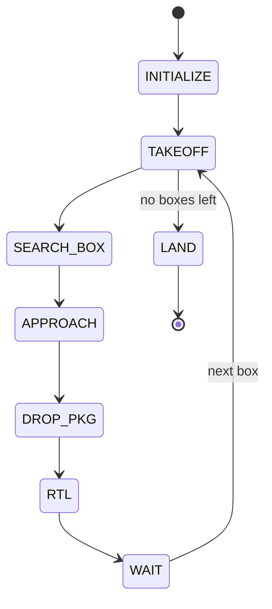

# Package Delivery — Black Bee Challenge 2026

**Autonomous package-delivery mission for a MAVLink-controlled drone, orchestrated as a finite-state machine on ROS 2, built for the delivery event of the Black Bee Challenge 2026 (UNIFEI).**

## Overview

`package_delivery` flies a drone autonomously through a full "fly, find, drop" cycle, repeated once per package:

1. **Take off** to a configured altitude — unless every package has already been delivered.
2. **Fly to a GPS waypoint** marking the next target box.
3. **Locate the box** with a YOLO-based detector and **approach** it, visually servoing to center over it and descending to drop altitude.
4. **Release the package** by actuating the gripper's servo.
5. **Return to launch** and land.
6. **Wait for a human** to confirm a new package has been loaded onto the gripper, then repeat from takeoff for the next box.

The mission is built with [YASMIN](https://github.com/uleroboticsgroup/yasmin) (Yet Another State MachINe), a hierarchical finite-state-machine library for ROS 2, and can target either real hardware (MAVLink over serial) or a Gazebo SITL simulation, toggled by the `sim_mode` flag in `constants.py`.

The mission entry point is the `main()` function in `mangalarga.py`, which builds and runs the top-level state machine (`PackageDelivery`).

## Architecture

Unlike missions built from nested sub-state-machines, `PackageDelivery` is a single top-level FSM with a delivery loop: each pass through the loop takes off, delivers one box, and returns to land and wait — until `Takeoff` finds there are no boxes left.

### Mission — `PackageDelivery`




- `TAKEOFF` first checks whether any boxes are still pending (`i_box < len(target_box)`); if none remain it short-circuits straight to the FSM's `SUCCEED` outcome via the special `"END"` transition, instead of taking off again.
- A failure in `SEARCH_BOX` goes straight to `LAND` (the mission is aborted without attempting RTL); failures in `APPROACH` or `DROP_PKG` are routed through `RTL` before landing.
- `WAIT` is a human-in-the-loop state: the operator types `yes` at the terminal to confirm a new package has been clipped onto the gripper before the next takeoff.

Spotting a difference from a fully-automated mission: `WAIT` is the only place execution pauses for a person, and it sits between `RTL` and the next `TAKEOFF` in every delivery cycle but the last.

> Note: the `Approach` state declares `TIMEOUT` and `FAIL` outcomes in addition to `SUCCEED`/`ABORT`, but only `SUCCEED`/`ABORT` are currently wired into transitions in `mangalarga.py` — worth checking if you touch that logic.

## Project structure

```
package_delivery/
├── constants.py            # Config: every mission parameter
├── mangalarga.py           # entry point — builds and runs PackageDelivery
├── test_servo.py           # bench test for the gripper (open/close)
├── test_wait.py            # trimmed-down FSM to test the WAIT/GRIPPER cycle
└── states/
    ├── core.py             # Initialize, Takeoff, Land, Rtl
    ├── search_box.py       # SearchBox
    ├── approach.py         # Approach
    ├── gripper.py          # Gripper (used as DROP_PKG)
    └── wait.py             # Wait
```

## State reference

### Core mission states — `states/core.py`

| State | Outcomes | Purpose |
|---|---|---|
| `Initialize` | `SUCCEED`, `ABORT` | Records the mission start time; connects to the drone (`MavrosDrone`/`MavlinkDrone`, or SITL/Gazebo when `sim_mode` is on); builds the `PIDController`s for x, y, and z; loads the box detector (YOLO, `models/best.pt`); opens the camera (OpenCV in hardware mode, a ROS topic in simulation) and takes a test photo. Populates the blackboard with `drone`, `pid_cx`, `pid_cy`, `pid_cz`, `detector_box`, `camera`, `has_thePkg`, `i_box`, and `start_time`. |
| `Takeoff` | `SUCCEED`, `ABORT`, `END` | If boxes are still pending (`i_box < len(target_box)`), takes off to `takeoff_altitude` (up to 5 retries); otherwise returns `END`, finishing the mission successfully without another takeoff. |
| `Land` | `SUCCEED`, `ABORT` | Commands the drone's final landing. |
| `Rtl` | `SUCCEED`, `ABORT` | Waits one second, then commands a return-to-launch to `rtl_altitude`, landing at the end (`land=True`). |

### `states/search_box.py`

| State | Outcomes | Purpose |
|---|---|---|
| `SearchBox` | `SUCCEED`, `ABORT` | Flies via GPS (`move_to_gps`) to the next target box's coordinates (`target_box`, or `sim_target_box` in simulation) at the configured safe altitude, and increments `i_box` on the blackboard. |

### `states/approach.py`

| State | Outcomes | Purpose |
|---|---|---|
| `Approach` | `SUCCEED`, `ABORT` (`TIMEOUT`/`FAIL` declared but unrouted) | Visual-servoing loop: runs the YOLO detector on every frame, converts the pixel offset to meters using the camera's field of view and current altitude (`ppm`), and applies PID control on x/y/z to center over the box and descend to `dropoff_altitude`. Confirms alignment after `required_frames` consecutive in-tolerance frames; if detection is lost for `lost_tolerance` frames, climbs (or descends, if already at the ceiling) and resets the PIDs to restart the search. Aborts on timeout (`approach_timeout`, and optionally a global `mission_timeout`). |

### `states/gripper.py`

| State | Outcomes | Purpose |
|---|---|---|
| `Gripper` | `SUCCEED`, `ABORT` | Used as `DROP_PKG` (`target_has_pkg=False`): descends slightly, then actuates the gripper's servo (`do_servo`, channel `servo_channel`, open/close PWM values) with up to `servo_retries` attempts and a settle delay (`servo_action_delay`) after success. Updates `has_thePkg` on the blackboard. |

### `states/wait.py`

| State | Outcomes | Purpose |
|---|---|---|
| `Wait` | `SUCCEED`, `ABORT` | Blocks until the operator types `yes` at the terminal, confirming a new package has been loaded onto the gripper before the next takeoff; `Ctrl+C` aborts the mission. |

## Shared blackboard keys

| Key | Set by | Read by |
|---|---|---|
| `drone` | `Initialize` | every state that moves the drone |
| `camera` | `Initialize` | `Approach` (via the `detector_box` callback) |
| `detector_box` | `Initialize` | `Approach` (indirectly, through the camera's image callback) |
| `pid_cx`, `pid_cy`, `pid_cz` | `Initialize` | `Approach` |
| `has_thePkg` | `Initialize`, `Gripper`, `Wait` | `Gripper` |
| `i_box` | `Initialize`, `SearchBox`, `Takeoff` | `Takeoff`, `SearchBox` |
| `start_time` | `Initialize` | `Approach` (mission timeout) |

## Requirements

- **ROS 2** (`rclpy`), packaged as `ament_python`
- **[YASMIN](https://github.com/uleroboticsgroup/yasmin)** and `yasmin_ros` — the hierarchical state-machine framework
- **`nectar`** — this project's own drone-control (`nectar.control`: `DroneFactory`, `MavrosDrone`/`MavlinkDrone`, `PIDController`, `RTLMethod`, SITL/Gazebo config) and vision/AI abstraction layer (`nectar.vision`: `ImageHandler`; `nectar.ai`: `Detector`/`DetectionResult`). A project-specific dependency — install it from wherever your team distributes it.
- **OpenCV** (`cv2`) — used to save debug snapshots of each detection
- YOLO weights for box detection (`models/best.pt`, included in the repository)
- A MAVLink-speaking flight controller reachable over serial (real hardware), or a Gazebo SITL setup for `sim_mode = True` (world at `simulation/worlds/package_delivery.sdf`, models under `simulation/gazebo_models/`)

## Configuration

Behavior is tuned entirely through the `Config` dataclass in `package_delivery/constants.py`, including:

- `sim_mode`, `sim_image_source`, `sim_image_compressed`, `sim_target_box` — simulation parameters
- `target_box` — ordered list of GPS coordinates (lat, long) for the boxes to deliver
- `box_model_source`, `box_class_name`, `box_conf` — YOLO model and confidence threshold
- `image_source`, `image_width`, `image_height` — camera source and resolution
- `approach_timeout`, `approach_tolerance`, `approach_tolerance_px`, `dropoff_altitude`, `required_frames`, `lost_tolerance`, `claw_offset` — visual-approach parameters
- `altitude_inc`, `safe_altitude`, `max_altitude` — altitude limits used while searching/approaching
- `drone_type`, `connection_string` — connection type (`mavlink`/`mavros`) and serial/UDP connection string
- `takeoff_altitude`, `rtl_altitude`, `land_altitude` — takeoff, RTL, and landing altitudes
- `servo_channel`, `servo_open_pwm`, `servo_closed_pwm`, `servo_retries`, `servo_retry_delay`, `servo_action_delay` — gripper servo configuration
- PID gains for x, y, and z (`x_kp`/`ki`/`kd`, `y_kp`/`ki`/`kd`, `z_kp`/`ki`/`kd`) and their output/integral limits

> The `constants.py` currently in the repository has unresolved merge-conflict markers around `altitude_inc`/`safe_altitude` — resolve these before running the mission.

## Running the mission

```bash
# via colcon, after building/sourcing the workspace
ros2 run package_delivery mangalarga

# or directly
python3 package_delivery/package_delivery/mangalarga.py
```

Helper scripts (also exposed as console-script entry points in `setup.py`):

```bash
ros2 run package_delivery test_servo   # bench test: opens and closes the gripper without flying
ros2 run package_delivery test_wait    # trimmed-down FSM for validating the WAIT/GRIPPER cycle
```

Regardless of where the mission fails, it always tries to come back safely: `SEARCH_BOX` failures go straight to `LAND`, while `APPROACH` and `DROP_PKG` failures are routed through `RTL` before landing.

## Runtime artifacts

- `models/` — the detector's YOLO weights (`best.pt` in active use, `best_old.pt` kept as a previous reference); intentionally tracked despite `.gitignore`.
- Raw and annotated frames from every detection cycle are saved under `~/ros2_ws/pkgdelivery-<timestamp>/box/` and `.../box_annotated/`, produced by `Initialize`'s image callback.
- `simulation/` — the Gazebo world (`worlds/package_delivery.sdf`) and models (`gazebo_models/`, with `.blend`/`.xcf` sources in `blender_models/`) used to test the mission in SITL.

## Competition reference

The official event rulebook is [`Regulamento_oficial_Black_Bee_challenge_1_0.pdf`](./Regulamento_oficial_Black_Bee_challenge_1_0.pdf), published by Black Bee Drones (UNIFEI).